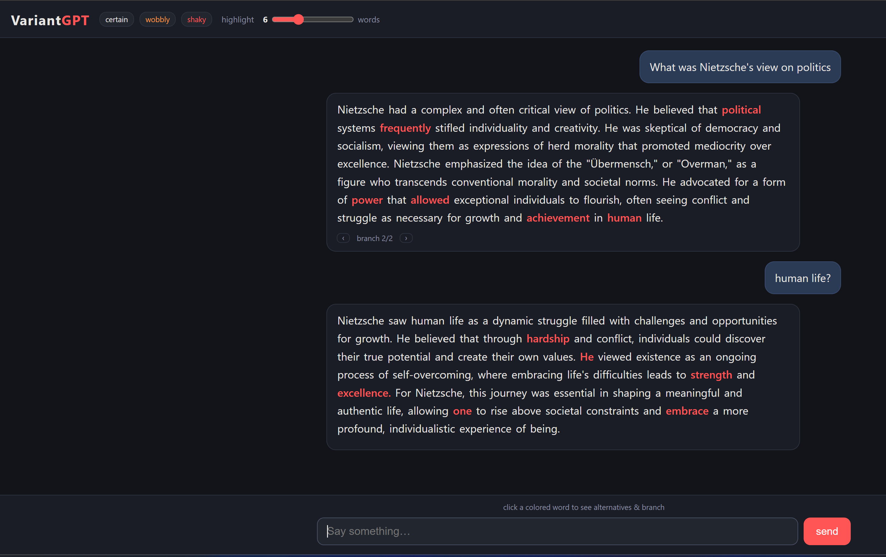
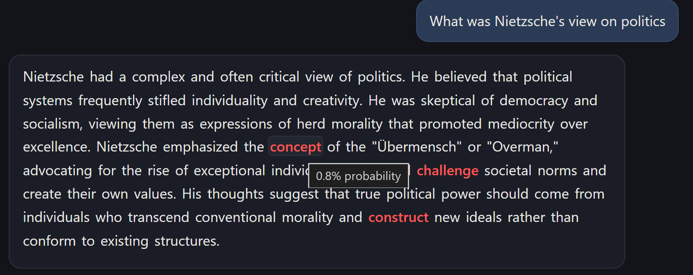
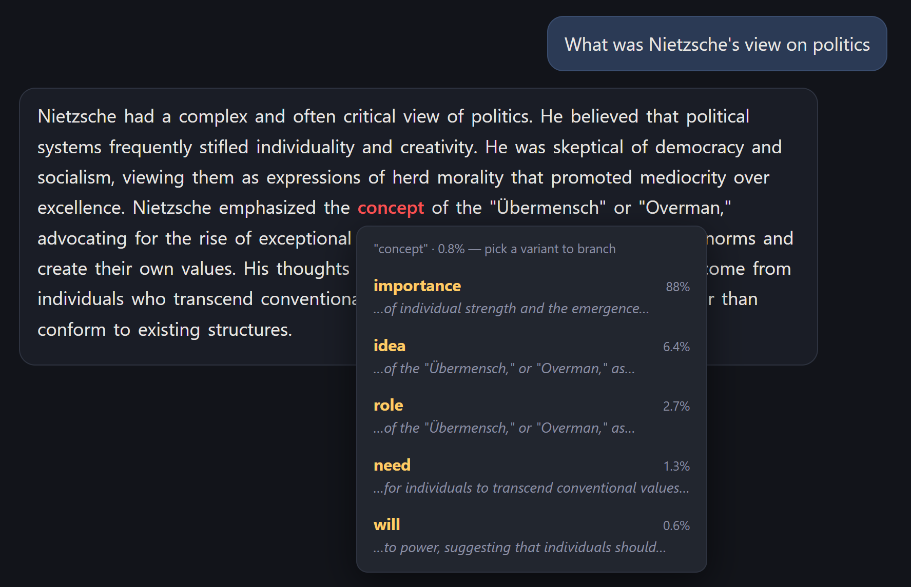
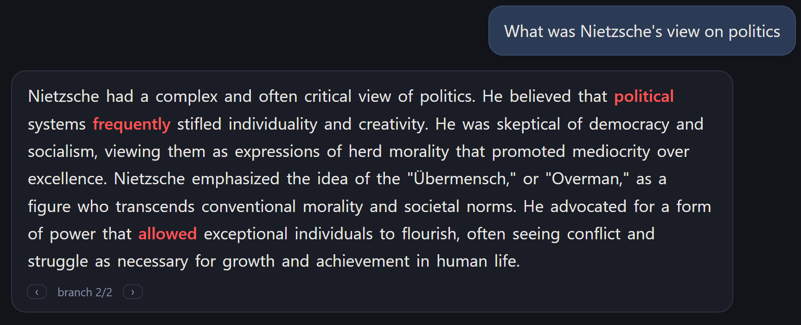

# VariantGPT

Chat UI where every word of the answer is colored by how probable it was -
white = certain, amber = wobbly, red = shaky. Click a highlighted word to see
the alternatives the model considered (each with a live-generated preview of
where it leads) and branch the reply from that point.



Motivation: the low-probability words are where to look. That is where the
model was choosing among options, and where a hallucination is most likely to
hide. (Caveat: low probability often just means stylistic freedom, e.g.
"vibrant" vs "beautiful", not an error.)

Powered by OpenAI logprobs: one API call returns the answer plus exact
per-token probabilities and the top alternatives, so coloring is instant.

## Changing a word, in three steps

**1. The least-certain words are highlighted.** Hover any of them to see its
exact probability. Here "concept" was only 0.8% likely, so the model was
wide open about how to phrase this.



**2. Click it to see the alternatives the model considered** - each with its
probability and a preview of where that choice would lead. The model actually
preferred "importance" (88%); "concept" was a long shot.



**3. Pick one and the reply regenerates from that choice** as a new branch.
Here "idea" was chosen, and the rest of the answer rewrote itself around it.
The `‹ ›` control navigates between branches.



## Run

```sh
bun run server.ts   # http://0.0.0.0:4777
```

Put `OPENAI_API_KEY=sk-...` in `~/nil/variantgpt/.env` (read per-request, so no
restart needed when you add or change it). Optional: `OPENAI_MODEL=...`
(default `gpt-4o-mini`).

## How it works

1. **Generate** — one chat completion with `logprobs: true, top_logprobs: 8`.
2. **Color** — subword tokens are reassembled into words; a word's probability
   is the min over its tokens. The header slider picks how many of the
   least-certain words to highlight (the rest render as plain text).
3. **Preview** — opening a word's menu fires one short continuation per
   alternative (`/api/preview`) so you can see where each variant would go
   before committing. Results are cached on the alternative.
4. **Branch** — picking an alternative regenerates the tail from that choice
   (`/api/branch`) as a new version; `‹ ›` navigates between branches. The
   swapped-in word keeps its siblings, so you can re-open it and pick again.

## Endpoints

- `POST /api/message` `{text}` → `{vid, words}`
- `POST /api/preview` `{vid, pos, token}` → `{preview}`
- `POST /api/branch` `{vid, pos, phrase, prob}` → `{vid, words}`
- `POST /api/reset`, `GET /api/state`

`word = {text, prob, alts:[{phrase, prob, preview?}]}`
